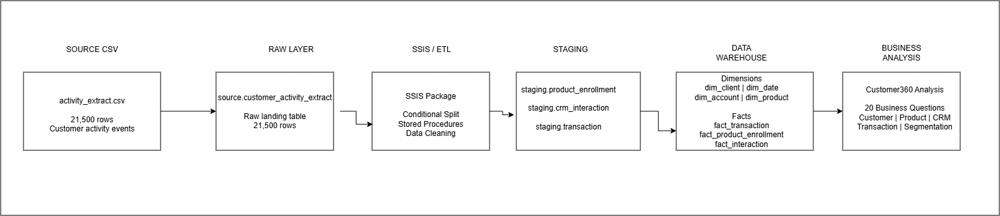

# Customer 360 Intern Project

## Lebohang Letsela - Customer360 Implementation

This repository contains my implementation of the Customer360 Data Warehouse capstone using SQL Server and SQL Server Integration Services (SSIS).

The solution transforms a single raw banking activity extract containing 21,500 events into a structured dimensional warehouse supporting customer, product, transaction and CRM analysis.

### Solution Architecture



The pipeline follows six main stages:

`CSV Source -> Raw Landing -> SSIS / ETL -> Staging -> Dimensional Warehouse -> Business Analysis`

The raw extract is first loaded into `source.customer_activity_extract`. SSIS then orchestrates the staging and warehouse loads, with stored procedures performing data cleaning, standardisation and dimensional loading.

### Dimensional Model

The final Customer360 warehouse uses a fact constellation with shared dimensions.

**Dimensions**

- `dw.dim_client`
- `dw.dim_date`
- `dw.dim_account`
- `dw.dim_product`

**Facts**

- `dw.fact_transaction`
- `dw.fact_product_enrollment`
- `dw.fact_interaction`

The warehouse uses surrogate keys for dimensional relationships. Client and account attributes use an SCD Type 1 approach.

### Data Quality

Data profiling identified several source data quality conditions, including inconsistent mobile-number formatting, missing contact information, inconsistent province naming, missing CRM resolution values, orphan transaction accounts and zero-value transactions.

Valid unusual records were preserved rather than automatically deleted. Where appropriate, values were standardised, converted to NULL or Unknown, or represented using data-quality flags.

Full details are available in:

`docs/data_quality.md`

### ETL Implementation

The SSIS Control Flow executes the pipeline in the following sequence:

1. `01_truncate_source`
2. `02_load_raw_source`
3. `03_stage_events`
4. `04_load_staging`
5. `05_create_dw_tables`
6. `06_load_dimensions`
7. `07_load_facts`

Stored procedures used by the pipeline include:

- `dbo.usp_load_staging`
- `dbo.usp_load_dimensions`
- `dbo.usp_load_facts`

Detailed SSIS documentation and execution screenshots are available in:

`docs/ssis_pipeline.md`

### Validation Results

A successful pipeline run produces the following expected row counts:

| Table | Expected Rows |
|---|---:|
| `source.customer_activity_extract` | 21,500 |
| `staging.product_enrollment` | 2,000 |
| `staging.crm_interaction` | 4,500 |
| `staging.transaction` | 15,000 |
| `dw.dim_client` | 1,484 |
| `dw.dim_product` | 3 |
| `dw.dim_account` | 2,010 |
| `dw.dim_date` | 1,490 |
| `dw.fact_product_enrollment` | 2,000 |
| `dw.fact_interaction` | 4,500 |
| `dw.fact_transaction` | 15,000 |

### Business Analysis

The final warehouse is used to answer all 20 Customer360 business questions covering:

- Customer demographics and growth
- Product holdings and cross-sell opportunities
- Transaction behaviour
- CRM interactions and resolution rates
- Customer activity and lifecycle segmentation
- Customer value tiers
- Retention
- Unusual transaction patterns

The completed analysis is available in:

`sql/08_business_questions.sql`

### How to Run the Project

#### Prerequisites

Install:

- SQL Server
- SQL Server Management Studio (SSMS)
- Visual Studio or SSDT with SQL Server Integration Services

#### 1. Clone the Repository

Clone the repository and check out the project branch.

#### 2. Create the Database Structures

Run:

`sql/00_create_tables.sql`

This creates the `Customer360_DW` database, required schemas, raw landing table and staging tables.

#### 3. Configure SSIS

Open the SSIS project located in:

`customer360_etl/`

Update the SQL Server connection manager so that it points to your local `Customer360_DW` database.

Update the Flat File Connection Manager so that it points to:

`data/raw/activity_extract.csv`

on your local cloned repository.

Connection paths are machine-specific and therefore must be configured for the environment where the package is executed.

#### 4. Create the Stored Procedures

Run:

`sql/07_stored_procedures.sql`

The script uses `CREATE OR ALTER PROCEDURE`, allowing the procedures to be created on a new database or updated when they already exist.

#### 5. Run the SSIS Package

Execute the main Customer360 SSIS package.

The package will:

- Clear and reload the raw landing table
- Load and clean the staging layer
- Create the dimensional warehouse structures
- Load dimensions before dependent facts
- Populate the three fact tables

#### 6. Validate the Load

Compare the resulting table counts with the expected counts shown in the Validation Results section above.

#### 7. Run the Business Analysis

Execute:

`sql/08_business_questions.sql`

The queries run against the dimensional warehouse rather than the raw or staging layers.

### Project Documentation

Additional documentation is available under `docs/`:

- Data quality findings: `docs/data_quality.md`
- SSIS pipeline documentation: `docs/ssis_pipeline.md`
- Pipeline architecture: `docs/architecture/customer360_pipeline.drawio`
- Pipeline architecture export: `docs/architecture/customer360_pipeline.png`
- Dimensional model ERDs: `docs/erd/`

---

A self-contained data engineering capstone for the April-May 2026 intern
intake: build a star-schema data warehouse from a single raw banking
extract, using SSIS and SQL Server.

**Due date: 27 September 2026.** Open your pull request by this date, see
[How to submit your work](#how-to-submit-your-work).

## Background

You work in the data team of a South African retail bank. The bank's
systems were never designed to talk to each other, and the only thing
anyone has ever managed to get out of them is a single flat export: one
big activity file covering client details, product enrollments, CRM
contact history, and transactions, all mixed together. Nobody has ever
built a proper warehouse for this data. Reporting today is a person
manually pulling spreadsheets.

You have been asked to build the first version of a Customer 360 data
warehouse: a dimensional model that the BI team can connect Power BI or
Tableau to, fed by a repeatable SSIS ETL pipeline.

## Objective

Design and build a star schema data warehouse in SQL Server, loaded by
SSIS, from the single raw extract provided in `data/raw/`. Use it to
answer the business questions in `docs/questions.md`.

This is a skills project. The point is not to reach one correct answer,
it is to show that you can:

* Profile a messy, denormalized source file and work out what is
  actually in it
* Recognize the different entities and event types hiding inside a
  single extract, and design sensible keys for each
* Design a sensible dimensional model: grain, dimensions, facts, and how
  they relate
* Build an SSIS package that lands, splits, and transforms the data
* Write SQL against your model to answer real business questions
* Explain and justify the decisions you made

There is no single correct schema. Two interns can both pass with
different, well justified designs.

## Repo structure

```
README.md                     this file, the full brief
data/raw/
    activity_extract.csv       the one raw source file, comma delimited
docs/
    dictionary.md               column level definitions of the raw extract
    questions.md                 the questions to answer with SQL against your model
sql/
    00_create_tables.sql        DDL for the landing/source schema
```

Keep this same short, flat naming style for anything you add: lowercase,
underscores, no spaces, no version numbers in the file name (git already
tracks versions for you).

## What you are given

`data/raw/activity_extract.csv` is a single comma delimited file, exactly
as it came out of the source system, not cleaned and not split into
tables. Every row is one event for one client. An `event_type` column
tells you whether the row is a product enrollment, a CRM interaction, or
a transaction, and a different subset of the remaining columns is
populated depending on which type it is. Client details such as name,
contact details, and signup date repeat on every row belonging to that
client.

There are no ready made table identifiers in this file. There is a
client_number and an account_number, because a real extract still needs
something to key on, but there is nothing marking out separate
enrollment, interaction, or transaction records. Working out how to key
and deduplicate each entity is part of the exercise.

See `docs/dictionary.md` for a full column reference. Treat this as a
real source system handoff. Nobody has told you what is wrong with it.
Profiling it is part of the task.

`sql/00_create_tables.sql` gives you a `CREATE TABLE` statement for a
single `source` schema table matching the raw file, so you have a
consistent landing point to import into via SSIS, using a Flat File
Source. You are not required to use it as is. Adjust data types if your
profiling says otherwise, and justify the change.

## What you must build

### ETL (SSIS)

* One or more SSIS packages, built in Visual Studio or SSDT with the
  SSIS extension, that load the raw extract into SQL Server and populate
  your dimensional model.
* Use a staging layer, a raw load with minimal transformation, separate
  from the final dimensional model. Do not transform everything in a
  single monolithic step.
* Use a Conditional Split, or an equivalent approach, to separate the
  three event types out of the single source file before building your
  dimensions and facts from them.
* Handle at least: data type conversion, whitespace and casing cleanup,
  and invalid or missing values. Decide for yourself what counts as
  invalid here, profile the data first.
* Sequence your control flow correctly. A fact cannot load before the
  dimension it depends on exists.
* Your packages must be re runnable without duplicating data. Truncate
  and reload is acceptable for this exercise. Incremental loading is a
  bonus, not a requirement.

### Dimensional model

Design a star schema, or a snowflake schema if you can justify it, in a
`dw` schema in SQL Server. At minimum you will need:

* A date dimension. Build it, do not carry raw date strings into your
  facts.
* A client dimension, built by deduplicating the repeated client details
  in the source file.
* A product dimension, built from the enrollment style rows.
* At least two fact tables at different, clearly stated grains, for
  example one fact per transaction and one fact per CRM interaction. You
  may combine them if you can justify the resulting grain.

You decide: how you generate surrogate keys for each dimension, since the
source file does not hand you any, which attributes belong on which
dimension, whether the client dimension needs to track history (SCD Type
1 versus Type 2, pick one and be able to explain why), and how you handle
the data quality issues you find, whether that is rejecting, correcting,
or flagging them with an unknown member row. All are valid approaches,
pick one and justify it.

Deliver an entity relationship diagram of your final model, built in
[draw.io](https://app.diagrams.net/) (diagrams.net), alongside the DDL.
Export it as a PNG or PDF and commit both the export and the `.drawio`
source file.

### SQL analysis

Write the SQL queries that answer every question in `docs/questions.md`,
run against your dimensional model, not the raw or staging tables.
Include the SQL and the result for each.

## Tech stack

* SQL Server, Developer or Express edition, plus SQL Server Management
  Studio
* SQL Server Integration Services, via SSDT or Visual Studio
* draw.io (diagrams.net) for the entity relationship diagram

## How to submit your work

1. Fork this repo to your own GitHub account (or create a branch if you
   already have write access).
2. Clone your fork locally: `git clone <your-fork-url>`.
3. Create a branch for your work, named after you, for example
   `git checkout -b intern/thabo-m`.
4. Commit as you go, in small steps, with clear messages, for example
   `git commit -m "Add dw schema DDL for client and date dimensions"`.
   Do not commit one giant "final version" at the end.
5. Push your branch: `git push origin intern/thabo-m`.
6. Open a pull request against this repo's `main` branch when you are
   ready for review. Put your data quality note and a short summary of
   your design decisions in the pull request description.

Commit your SSIS project files, your DDL scripts, your SQL answer
scripts, your draw.io diagram, and your data quality write-up. Do not
commit SQL Server backup files (`.bak`) or anything containing real
credentials or connection strings with passwords in them.

## Deliverables checklist

* `dw` schema DDL, dimensions and facts, with comments explaining key
  design decisions
* Entity relationship diagram of the final dimensional model (draw.io
  source file plus a PNG or PDF export)
* SSIS project, package files and project file
* A short data quality note describing what you found in the raw file
  and how you handled each issue
* SQL scripts answering every question in `docs/questions.md`, with
  results
* A short write-up explaining how to run your pipeline end to end

## Suggested timeline

Two weeks, structured roughly as follows.

Days one and two: profile the raw extract, document the data quality
issues you find, and sketch the dimensional model on paper or in draw.io
before writing any DDL.

Days three and four: build the staging load in SSIS, and write the `dw`
schema DDL.

Days five to seven: build the dimension and fact loads in SSIS, and test
the pipeline end to end.

Days eight and nine: write and validate the SQL for every question.

Day ten: write up your data quality notes, finish the entity relationship
diagram, and open your pull request.

## Evaluation criteria

You will be assessed on the following.

**Correctness.** Does the model actually answer the business questions,
and do the numbers make sense? For example, no double counted
transactions from a bad join.

**Modelling judgment.** Sensible grain, sensible key choices, dimensions
and facts used correctly, and evidence that the design followed from
profiling the data rather than from whichever join happened to work
first.

**ETL craftsmanship.** Is the SSIS package readable, does it fail loudly
on bad data rather than silently succeeding, and is it re runnable.

**Data quality handling.** Did you find the real issues in the file, and
did you make and justify a defensible decision about each one, rather
than deleting anything that looked unusual.

**Communication.** Can you explain your design decisions to a non
technical stakeholder in your write up and pull request description.
