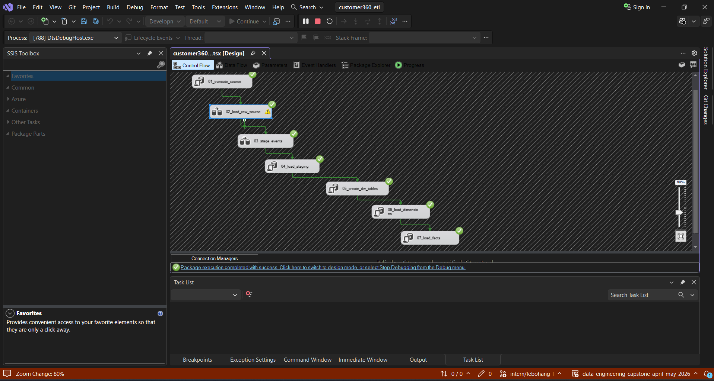
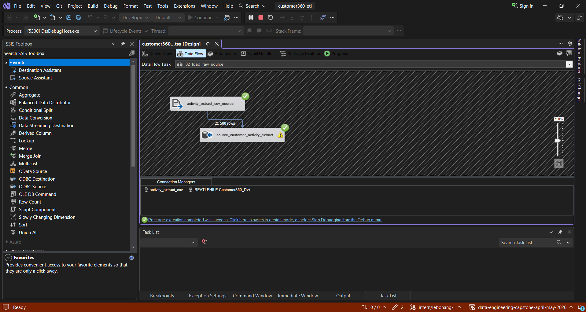

# Customer360 SSIS ETL Pipeline

## Overview

The Customer360 ETL pipeline was developed using SQL Server Integration Services (SSIS). The package orchestrates the movement of customer activity data from a flat CSV extract through the raw and staging layers and into the final dimensional data warehouse.

The pipeline is designed to be rerunnable and follows a controlled execution sequence so that source loading, staging, dimension loading and fact loading occur in the correct order.

## SSIS Control Flow

The SSIS package executes seven tasks in sequence:

1. `01_truncate_source`
2. `02_load_raw_source`
3. `03_stage_events`
4. `04_load_staging`
5. `05_create_dw_tables`
6. `06_load_dimensions`
7. `07_load_facts`

Successful completion of one task allows the next task in the pipeline to execute.

---

## Step 01 - Truncate Source

**Purpose:** Prepare the raw landing table for a fresh load.

The first task clears `source.customer_activity_extract` before loading the source file.

A truncate-and-reload approach was selected for the raw layer so that rerunning the package does not append the same source data and create duplicate raw records.

---

## Step 02 - Load Raw Source

**Purpose:** Load the original customer activity extract into SQL Server.

The SSIS Data Flow reads `activity_extract.csv` using a Flat File Source and loads the records into:

`source.customer_activity_extract`

The source extract contains **21,500 rows**. The raw landing table preserves the source data before business transformations are applied.

This provides a clear separation between the original source data and the cleaned data used by the warehouse.

---

## Step 03 - Stage Events

**Purpose:** Identify the different business event types contained in the flat source extract.

The original CSV contains three event types:

- Product Enrollment
- CRM Interaction
- Transaction

A Conditional Split is used in SSIS to identify these event types.

The event type determines which staging process the record belongs to. This separates the original wide customer activity extract into business-specific datasets before warehouse loading.

---

## Step 04 - Load Staging

**Purpose:** Clean, standardise and load the three staging datasets.

The task executes:

`dbo.usp_load_staging`

The stored procedure populates:

- `staging.product_enrollment`
- `staging.crm_interaction`
- `staging.transaction`

The staging layer applies the data-quality rules identified during profiling. Examples include standardising province names, cleaning mobile numbers, handling missing values and standardising CRM resolution values.

Data types are also converted from the loose raw source representation into types appropriate for downstream processing.

The staging layer contains:

- 2,000 Product Enrollment records
- 4,500 CRM Interaction records
- 15,000 Transaction records

Total staged events: **21,500**

---

## Step 05 - Create Data Warehouse Tables

**Purpose:** Ensure the dimensional warehouse structures required by the pipeline are available.

This step creates the final dimensional model used by Customer360.

The warehouse contains four conformed dimensions:

- `dw.dim_client`
- `dw.dim_date`
- `dw.dim_account`
- `dw.dim_product`

and three fact tables:

- `dw.fact_product_enrollment`
- `dw.fact_interaction`
- `dw.fact_transaction`

The model uses surrogate keys for warehouse relationships while retaining source business identifiers where required.

---

## Step 06 - Load Dimensions

**Purpose:** Populate the dimensional tables before loading dependent facts.

The task executes:

`dbo.usp_load_dimensions`

Dimensions are loaded before facts so that the required surrogate keys are available when fact records are created.

The resulting dimension counts are:

- `dim_client`: 1,484
- `dim_product`: 3
- `dim_account`: 2,010
- `dim_date`: 1,490

The client, product and account dimensions use a Type 1 approach, where the warehouse retains the latest standardised representation rather than storing historical dimension versions.

---

## Step 07 - Load Facts

**Purpose:** Load the final business-event fact tables.

The task executes:

`dbo.usp_load_facts`

The resulting fact counts are:

- `fact_product_enrollment`: 2,000
- `fact_interaction`: 4,500
- `fact_transaction`: 15,000

Together, the three fact tables preserve all **21,500 business events** represented in the source extract.

Transaction data-quality conditions are preserved rather than silently removed. This includes 10 transactions associated with accounts that do not have a corresponding Product Enrollment record and 26 zero-amount transactions. These conditions are represented using warehouse data-quality flags.

---

## Pipeline Result

The completed SSIS package successfully transforms the original flat customer activity extract into a queryable Customer360 dimensional warehouse.

The overall processing flow is:

`CSV Source -> Raw Landing -> Event Separation -> Staging -> Dimensions -> Facts -> Business Analysis`

The final warehouse supports the customer, product, transaction, CRM and segmentation analysis contained in `sql/08_business_questions.sql`.